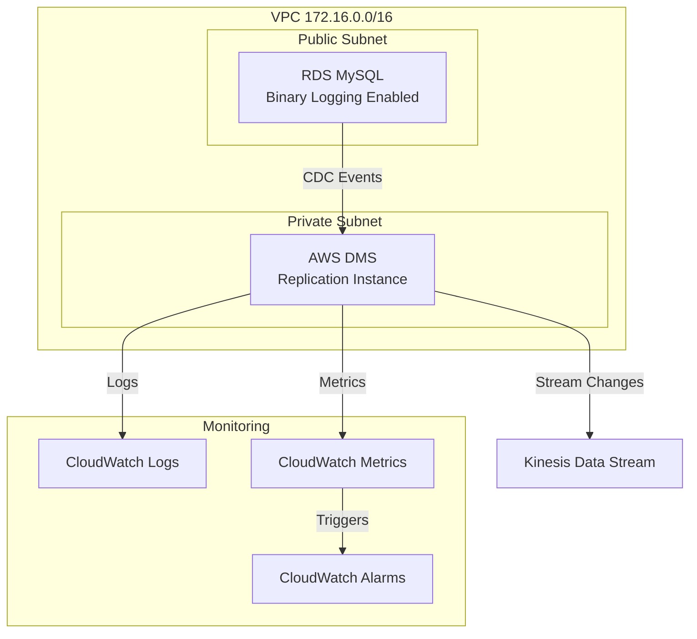

# MySQL to Kinesis CDC Pipeline with AWS DMS

This project implements a Change Data Capture (CDC) pipeline that streams changes from a MySQL database to Amazon Kinesis using AWS Database Migration Service (DMS). The infrastructure is defined using AWS CDK in TypeScript.


## Run

```bash
# 1. Deploy CDK
npm install
cdk bootstrap
cdk deploy

# 2. Get RDS credentials from Secrets Manager
aws secretsmanager get-secret-value \
  --secret-id $(aws cloudformation describe-stacks \
    --stack-name DmsMysqlKinesisCloudwatch1Stack \
    --query 'Stacks[0].Outputs[?OutputKey==`RdsSecretName`].OutputValue' \
    --output text) \
  --query 'SecretString' \
  --output text

# 3. Connect to MySQL using the credentials from Secrets Manager
mysql -h <rds_endpoint> -P 3306 -u <username> -p

# 4. Run the setup SQL script
# Copy the contents of sql/setup.sql and run them in MySQL

# 5. Verify MySQL Configuration
SHOW VARIABLES LIKE 'log_bin';  # Should be ON
SHOW VARIABLES LIKE 'binlog_format';  # Should be ROW
SHOW MASTER STATUS;  # Should show binary log info

# 6. Test DMS Endpoints
# Go to AWS DMS Console
# Select Endpoints
# Test the source endpoint (MySQL) - should succeed
# Test the target endpoint (Kinesis) - should succeed

# 7. Start DMS Task
# Go to AWS DMS Console > Tasks
# Select your task and click "Start/Resume"
# Monitor the task status and metrics

# 8. Verify Data Flow
# Insert test data into MySQL
USE mydb;
INSERT INTO users (name, email) VALUES ('Test User 3', 'test3@example.com');

# Check Kinesis for the changes
aws kinesis get-records --stream-name mysql-cdc-stream \
  --shard-iterator $(aws kinesis get-shard-iterator \
    --stream-name mysql-cdc-stream \
    --shard-id 0 \
    --shard-iterator-type TRIM_HORIZON \
    --query 'ShardIterator' \
    --output text)
```

### Troubleshooting Connection Issues

1. **MySQL Connection Issues:**
   - Check Secrets Manager for correct credentials
   - Verify security group allows access from DMS security group
   - Verify binary logging is enabled
   - Test direct connection with mysql client

2. **DMS to Kinesis Issues:**
   - Verify IAM roles and permissions
   - Check Kinesis stream is active
   - Verify DMS task settings
   - Monitor CloudWatch logs for errors

3. **Common Fixes:**
   - Re-test endpoints in DMS console
   - Check security group rules
   - Verify all IAM permissions
   - Monitor CloudWatch logs for detailed error messages
   - Ensure DMS has access to Secrets Manager


## Architecture

The architecture implements a real-time CDC pipeline with the following components:

1. **Source**: Amazon RDS MySQL instance with binary logging enabled
2. **Pipeline**: AWS DMS for change capture and replication
3. **Target**: Amazon Kinesis Data Stream
4. **Monitoring**: CloudWatch Logs and Metrics with Alarms

### Architecture Diagram



### Components

- **Amazon RDS MySQL**
  - Publicly accessible (for testing)
  - Binary logging enabled (ROW format)
  - Located in public subnet
  - Configured with necessary replication permissions

- **AWS DMS**
  - t3.micro replication instance
  - Located in private subnet
  - CDC-only migration type
  - JSON output format
  - Enhanced monitoring and logging

- **Amazon Kinesis**
  - Single shard (configurable)
  - 24-hour retention period
  - Provisioned capacity mode

- **CloudWatch Integration**
  - Dedicated log group for DMS tasks
  - Replication lag monitoring
  - Automated alarms for high latency

## Prerequisites

- AWS CLI installed and configured
- Node.js 14.x or later
- AWS CDK CLI installed (`npm install -g aws-cdk`)
- TypeScript 3.9 or later

## Installation

1. Clone the repository:
   ```bash
   git clone [repository-url]
   cd dms-mysql-kinesis-cloudwatch-1
   ```

2. Install dependencies:
   ```bash
   npm install
   ```

3. Bootstrap CDK (if not done before):
   ```bash
   cdk bootstrap
   ```

4. Deploy the stack:
   ```bash
   cdk deploy
   ```

## Configuration

The stack uses default values that can be modified in `lib/dms-mysql-kinesis-cloudwatch-1-stack.ts`:

- VPC CIDR: 172.16.0.0/16
- RDS Instance: t3.micro
- DMS Instance: t3.micro
- Kinesis: 1 shard
- CloudWatch Log Retention: 1 week
- Replication Lag Alarm: 5 minutes threshold

## Post-Deployment Setup

1. After deployment, note the outputs:
   - RDS endpoint
   - RDS credentials (in Secrets Manager)
   - Kinesis stream name
   - CloudWatch log group name

2. Connect to the RDS instance:
   ```bash
   mysql -h <rds-endpoint> -u admin -p
   ```

3. Create a test database and table:
   ```sql
   CREATE DATABASE mydb;
   USE mydb;
   CREATE TABLE users (
     id INT AUTO_INCREMENT PRIMARY KEY,
     name VARCHAR(255),
     email VARCHAR(255),
     created_at TIMESTAMP DEFAULT CURRENT_TIMESTAMP
   );
   ```

4. Test the CDC pipeline:
   ```sql
   INSERT INTO users (name, email) VALUES ('Test User', 'test@example.com');
   UPDATE users SET email = 'updated@example.com' WHERE id = 1;
   ```

5. Monitor changes:
   ```bash
   aws kinesis get-records --stream-name mysql-cdc-stream --shard-iterator $(aws kinesis get-shard-iterator --stream-name mysql-cdc-stream --shard-id 0 --shard-iterator-type TRIM_HORIZON --query 'ShardIterator' --output text)
   ```

## Monitoring

1. CloudWatch Logs:
   - Navigate to CloudWatch > Log Groups > /aws/dms/replication
   - View DMS task logs and replication events

2. CloudWatch Metrics:
   - Navigate to CloudWatch > Metrics > AWS/DMS
   - Monitor replication lag and other DMS metrics

3. CloudWatch Alarms:
   - Configured alarm for replication lag > 5 minutes
   - Additional alarms can be added in the stack

## Clean Up

To avoid incurring charges, destroy the stack when not needed:

```bash
cdk destroy
```

## Security Considerations

1. The RDS instance is publicly accessible for testing purposes. For production:
   - Move RDS to private subnet
   - Use AWS Systems Manager Session Manager for database access
   - Implement proper security groups and NACLs

2. Credentials are stored in AWS Secrets Manager
   - Rotate credentials regularly
   - Use appropriate IAM policies

3. VPC Security:
   - DMS is in private subnet
   - Security groups restrict access
   - Consider VPC endpoints for AWS services

## Troubleshooting

1. DMS Task Issues:
   - Check CloudWatch Logs for detailed error messages
   - Verify binary logging is enabled on RDS
   - Ensure proper permissions for replication user

2. Kinesis Issues:
   - Check IAM roles and permissions
   - Monitor shard utilization
   - Verify DMS task settings for Kinesis

3. Monitoring Issues:
   - Verify CloudWatch log group exists
   - Check IAM permissions for logging
   - Review metric dimensions and namespaces

## Contributing

1. Fork the repository
2. Create a feature branch
3. Commit your changes
4. Push to the branch
5. Create a Pull Request

## License

This project is licensed under the MIT License - see the LICENSE file for details.
