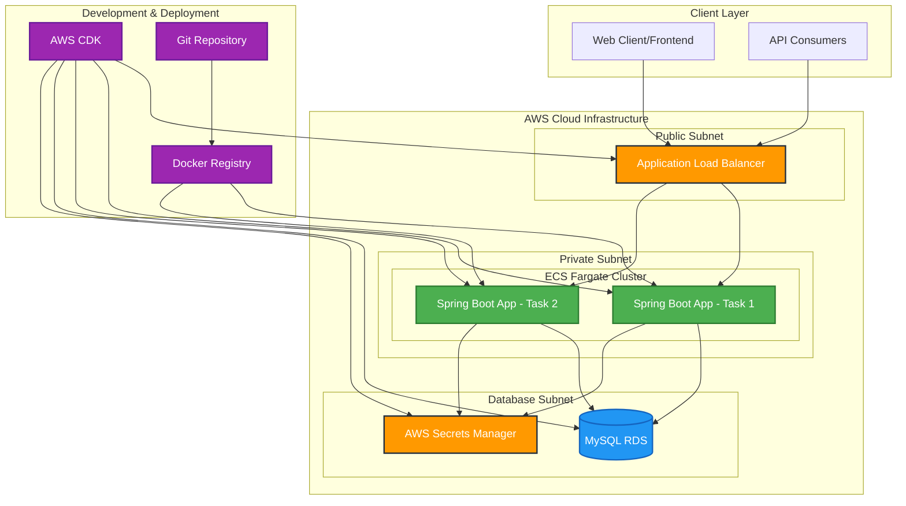

# Maze Solver

  

A full-stack cloud-native application for generating, solving, and managing mazes, built with Spring Boot backend and deployed on AWS using Infrastructure as Code (CDK).

  

## Project Overview

  

This project demonstrates a modern cloud-native approach to building and deploying Java applications. It features:

  

-  **Maze Generation**: Algorithmic maze generation with customizable dimensions

-  **Maze Solving**: Depth-First Search (DFS) algorithm for pathfinding

-  **Persistent Storage**: MySQL database for storing maze configurations

-  **RESTful API**: Comprehensive REST endpoints for maze operations

-  **Cloud Infrastructure**: AWS ECS Fargate with Application Load Balancer

-  **Infrastructure as Code**: AWS CDK for reproducible deployments

-  **Containerization**: Docker-based deployment with optimized JVM settings

-  **Comprehensive Testing**: Unit tests covering all application layers

  

## Architecture

  



  

### Architecture Components

  

#### **Frontend Layer**

-  **Application Load Balancer**: Public-facing entry point with health checks


#### **Application Layer**

-  **ECS Fargate**: Serverless container orchestration

-  **Spring Boot Application**: RESTful microservice for maze operations
  

#### **Data Layer**

-  **Amazon RDS MySQL**: Managed relational database

-  **AWS Secrets Manager**: Secure credential management

#### **Infrastructure Layer**

-  **VPC**: Isolated network environment with public/private subnets

-  **NAT Gateway**: Secure outbound internet access for private resources

-  **Security Groups**: Firewall rules for network security

  

## Backend Application

  

### Technology Stack

  

-  **Framework**: Spring Boot 3.4.5

-  **Java Version**: 17 (LTS)

-  **Database**: MySQL 8.0

-  **ORM**: Spring Data JPA with Hibernate

-  **Build Tool**: Maven

-  **Containerization**: Docker with multi-stage builds

-  **Testing**: JUnit 5 + Mockito + Spring Boot Test

  

### Core Features

  

#### Maze Operations

-  **Generate Maze**: Algorithmic generation with configurable dimensions

-  **Save Maze**: Persist maze configurations to database

-  **Solve Maze**: DFS pathfinding with visual solution

-  **CRUD Operations**: Full lifecycle management of maze entities

  

#### API Endpoints

  

```

POST /api/maze/generate # Generate new maze

POST /api/maze/save # Save maze to database

POST /api/maze/solve # Solve maze using DFS

GET /api/maze # Get all mazes

GET /api/maze/{id} # Get maze by ID

DELETE /api/maze/{id} # Delete maze

```

  

#### Application Layers

  

```

├── Controller Layer (REST API)

│ ├── MazeController # REST endpoints

│ └── Error Handling # Global exception handling

├── Service Layer (Business Logic)

│ ├── MazeService # Business operations

│ └── Transaction Management

├── Repository Layer (Data Access)

│ ├── MazeRepository # JPA repository

│ └── Database Operations

├── Utils Layer (Algorithms)

│ ├── MazeUtils # Generation & solving algorithms

│ └── DFS Implementation

└── Model Layer (Entities)

├── Maze Entity # JPA entity mapping

└── Database Schema

```

  

### Running the Backend Locally

  

```bash

# Navigate to backend directory

cd  maze-be-1

  

# Set Java 17

export  JAVA_HOME=$(/usr/libexec/java_home  -v  17)

  

# Run tests

./mvnw  test

  

# Build application

./mvnw  clean  package

  

# Run with development profile

./mvnw  spring-boot:run  -Dspring-boot.run.profiles=dev

  

# Or run JAR directly

java  -jar  target/maze-be-1-0.0.1-SNAPSHOT.jar

```

 

### CDK Project Structure

  

```

maze-cdk/

├── bin/

│ └── maze-cdk.ts # CDK app entry point

├── lib/

│ └── maze-cdk-stack.ts # Infrastructure definition

├── test/

│ └── maze-cdk.test.ts # Infrastructure tests

├── package.json # CDK dependencies

├── cdk.json # CDK configuration

└── tsconfig.json # TypeScript configuration

```

  

### Deployment Commands

  

```bash

# Navigate to CDK directory

cd  maze-cdk

  

# Install dependencies

npm  install

  

# Build CDK app

npm  run  build

  

# Deploy infrastructure

cdk  deploy

  

# View deployment outputs

cdk  outputs

  

# Destroy infrastructure (cleanup)

cdk  destroy

```

  

### Environment Variables

  

The application uses the following environment variables:

  

```bash

# Database Configuration

SPRING_DATASOURCE_URL=jdbc:mysql://${RDS_ENDPOINT}:3306/maze_db

SPRING_DATASOURCE_USERNAME=maze_admin

SPRING_DATASOURCE_PASSWORD=${SECRETS_MANAGER}

  

# JPA Configuration

SPRING_JPA_HIBERNATE_DDL_AUTO=update

SPRING_JPA_SHOW_SQL=true

SPRING_JPA_PROPERTIES_HIBERNATE_DIALECT=org.hibernate.dialect.MySQL8Dialect

  

# JVM Optimization

JAVA_TOOL_OPTIONS=-XX:+UseContainerSupport  -XX:MaxRAMPercentage=75.0

```

  

## Deployment & Operations

  

### Container Deployment

  

```bash

# Build and push Docker image

docker  build  -t  maze-app:latest  .

docker  tag  maze-app:latest  yennanliu/maze-app:dev-1

docker  push  yennanliu/maze-app:dev-1

  

# Force ECS service update

./force-update-ecs.sh  CLUSTER_NAME  SERVICE_NAME

```

  

### Monitoring & Logging

  

-  **CloudWatch Logs**: Centralized application logging

-  **ALB Access Logs**: HTTP request logging

-  **CloudWatch Metrics**: Application and infrastructure metrics

-  **Health Checks**: Application availability monitoring

  

## Considerations & TODOs

  

### Current Limitations

  

#### **Security**

- [ ] **HTTPS/TLS**: Currently HTTP only, need SSL/TLS termination

- [ ] **Authentication**: No user authentication/authorization

- [ ] **API Rate Limiting**: No request throttling

- [ ] **Input Validation**: Limited request validation

- [ ] **CORS Policy**: Currently allows all origins (`*`)

  

#### **Performance**

- [ ] **Caching**: No Redis/ElastiCache for maze caching

- [ ] **Database Connection Pooling**: Default connection pool settings

- [ ] **CDN**: No CloudFront for static asset delivery

- [ ] **Database Indexing**: Basic indexing strategy

  

#### **Reliability**

- [ ] **Circuit Breakers**: No resilience patterns implemented

- [ ] **Graceful Shutdown**: Basic shutdown handling

- [ ] **Database Migrations**: Using Hibernate auto-DDL

- [ ] **Blue-Green Deployment**: Single deployment strategy