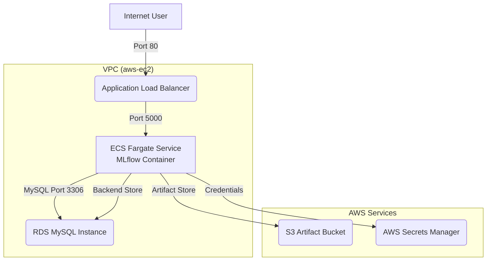

# MLflow Tracking Server on AWS Fargate

This project provides an AWS CDK stack in TypeScript to deploy a minimal, scalable MLflow Tracking Server on AWS ECS Fargate.

The stack includes:
- An **ECS Fargate service** running the official MLflow Docker container.
- An **Application Load Balancer (ALB)** to expose the MLflow server to the internet on port 80.
- An **S3 bucket** for storing MLflow artifacts (models, metrics, etc.).
- An **RDS for MySQL instance** as the backend metadata store.
- A **VPC** with public subnets to host the resources.
- **Security Groups** to manage traffic between the components.
- **IAM Roles** to grant necessary permissions for ECS tasks to access S3 and RDS credentials from AWS Secrets Manager.

## Architecture



## Prerequisites

- AWS Account and configured credentials
- Node.js installed
- AWS CDK Toolkit installed (`npm install -g aws-cdk`)

## Deployment

1. **Install dependencies:**
   ```bash
   npm install
   ```

2. **Bootstrap your AWS environment (if you haven't already):**
   ```bash
   cdk bootstrap
   ```

3. **Deploy the stack:**
   ```bash
   cdk deploy
   ```
   The deployment will take several minutes, primarily for the RDS instance to be provisioned.

4. **Access the MLflow UI:**
   After deployment, the CDK will output the DNS name of the Application Load Balancer (e.g., `MlflowStack1.MlflowAlbDns = ...`). Open this URL in your web browser to access the MLflow Tracking Server.

## Cleanup

To avoid incurring further charges, you can destroy the stack once you are finished.

```bash
cdk destroy
```


## Ref

- MLFlow
   - https://www.mlflow.org/docs/latest/ml/getting-started/logging-first-model/
   - https://learn.microsoft.com/zh-tw/azure/machine-learning/how-to-use-mlflow-cli-runs?view=azureml-api-2&tabs=interactive%2Ccli&source=post_page-----a5d7d6d87fab---------------------------------------
   - https://medium.com/ai-academy-taiwan/mlflow-a-machine-learning-lifecycle-platform-%E5%85%A5%E9%96%80%E6%95%99%E5%AD%B8-5ec222abf5f8