# Opensearch Stack 1

## Run

```bash

npm install

cdk bootstrap

# deploy

cdk deploy --all

# use default eks, pod cloudwatch log group
cdk deploy --all --stage dev

# send pods cloudwatch log to opensearch ONLY
cdk deploy --all --stage dev \
    -c podLogGroupName="/aws/eks/EksCluster3394B24C-ed22b92ec4764ec592ea533328f9e9da/application"


# send both eks, pods cloudwatch log to opensearch
cdk deploy --all --stage dev \
    -c domainName="opensearch-domain-dev-6" \
    -c eksLogGroupName="/aws/eks/EksCluster3394B24C-ec2cbedced464f24bf3f9d1c4b112048/cluster" \
    -c podLogGroupName="/aws/eks/EksCluster3394B24C-ec2cbedced464f24bf3f9d1c4b112048/application"

```

## CDK Architecture

```mermaid
graph TB
    subgraph "CDK Application"
        App[bin/app.ts]
        App --> SC[StackComposer]
        SC --> Config[ConfigManager]
    end

    subgraph "Configuration Layer"
        Config --> Parser[ConfigParser]
        Config --> Validator[ConfigValidator]
        Parser --> DevConfig[config/dev.json]
        Parser --> ProdConfig[config/prod.json]
    end

    subgraph "Infrastructure Stacks"
        SC --> NS[NetworkStack]
        SC --> OS[OpenSearchDomainStack]
        SC --> EKSFirehose[KinesisFirehose EKS Stack]
        SC --> PodFirehose[KinesisFirehose Pod Stack]
    end

    subgraph "NetworkStack (Optional)"
        NS --> VPC[VPC]
        NS --> Subnets[Private Subnets]
        NS --> SG[Security Groups]
    end

    subgraph "OpenSearchDomainStack"
        OS --> Domain[OpenSearch Domain]
        OS --> FirehoseRole[Firehose IAM Role]
        OS --> CWRole[CloudWatch Logs Role]
        OS --> RoleMapper[Role Mapper Lambda]
        Domain --> RoleMapper
    end

    subgraph "KinesisFirehoseStack (EKS)"
        EKSFirehose --> EKSDeliveryStream[Firehose Delivery Stream]
        EKSFirehose --> EKSProcessor[Unified Log Processor Lambda]
        EKSFirehose --> EKSBucket[S3 Backup Bucket]
        EKSFirehose --> EKSSubscription[CloudWatch Logs Subscription Filter]
    end

    subgraph "KinesisFirehoseStack (Pod)"
        PodFirehose --> PodDeliveryStream[Firehose Delivery Stream]
        PodFirehose --> PodProcessor[Unified Log Processor Lambda]
        PodFirehose --> PodBucket[S3 Backup Bucket]
        PodFirehose --> PodSubscription[CloudWatch Logs Subscription Filter]
    end

    subgraph "Lambda Functions"
        RoleMapper --> RoleMapperPy[opensearch-role-mapper.py]
        IndexManager[opensearch-index-manager.py]
        EKSProcessor --> UnifiedProcessor[unified-processor/index.js]
        PodProcessor --> UnifiedProcessor
        UnifiedProcessor --> SharedUtils[shared/log-processing.js]
    end

    subgraph "Data Flow"
        CloudWatchLogs[CloudWatch Logs] --> EKSSubscription
        CloudWatchLogs --> PodSubscription
        EKSSubscription --> EKSDeliveryStream
        PodSubscription --> PodDeliveryStream
        EKSDeliveryStream --> EKSProcessor
        PodDeliveryStream --> PodProcessor
        EKSProcessor --> Domain
        PodProcessor --> Domain
        EKSDeliveryStream -.-> EKSBucket
        PodDeliveryStream -.-> PodBucket
    end

    subgraph "External Dependencies"
        VPC -.-> Domain
        Subnets -.-> Domain
        SG -.-> Domain
        FirehoseRole --> Domain
        CWRole --> EKSDeliveryStream
        CWRole --> PodDeliveryStream
    end

    classDef configClass fill:#e1f5fe
    classDef stackClass fill:#f3e5f5
    classDef lambdaClass fill:#fff3e0
    classDef dataClass fill:#e8f5e8
    
    class Config,Parser,Validator,DevConfig,ProdConfig configClass
    class NS,OS,EKSFirehose,PodFirehose stackClass
    class RoleMapperPy,IndexManager,UnifiedProcessor,SharedUtils lambdaClass
    class CloudWatchLogs,Domain,EKSDeliveryStream,PodDeliveryStream dataClass
```



### Architecture Overview

This CDK application implements a centralized logging solution that ingests CloudWatch logs from EKS clusters and Pod applications into OpenSearch for analysis and visualization.

#### Key Components:

**Configuration Layer:**
- Environment-specific configuration management (dev/prod)
- Type-safe configuration parsing and validation
- Centralized configuration in JSON files

**Infrastructure Stacks:**
- **NetworkStack**: Optional VPC, subnets, and security groups for OpenSearch domain
- **OpenSearchDomainStack**: OpenSearch domain with IAM roles and security configuration
- **KinesisFirehoseStack**: Data pipeline for log ingestion (separate stacks for EKS and Pod logs)

**Lambda Functions:**
- **Role Mapper**: Configures OpenSearch security roles for Firehose access
- **Index Manager**: Manages OpenSearch indices and templates
- **Unified Processor**: Processes and transforms CloudWatch logs for OpenSearch ingestion

**Data Pipeline:**
1. CloudWatch Logs → Subscription Filters
2. Subscription Filters → Kinesis Data Firehose
3. Firehose → Lambda Processor (log transformation)
4. Lambda Processor → OpenSearch Domain
5. Failed records → S3 Backup Buckets

#### Features:
- **Environment-aware**: Separate configurations for dev/prod environments
- **Flexible networking**: Optional VPC deployment for enhanced security
- **Unified processing**: Single Lambda processor handles both EKS and Pod logs
- **Error handling**: S3 backup for failed deliveries
- **Security**: IAM roles with least-privilege access
- **Monitoring**: CloudWatch Logs for Firehose operations

