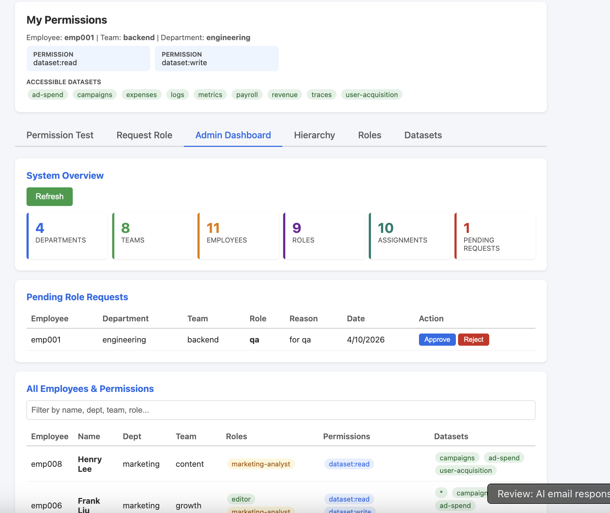
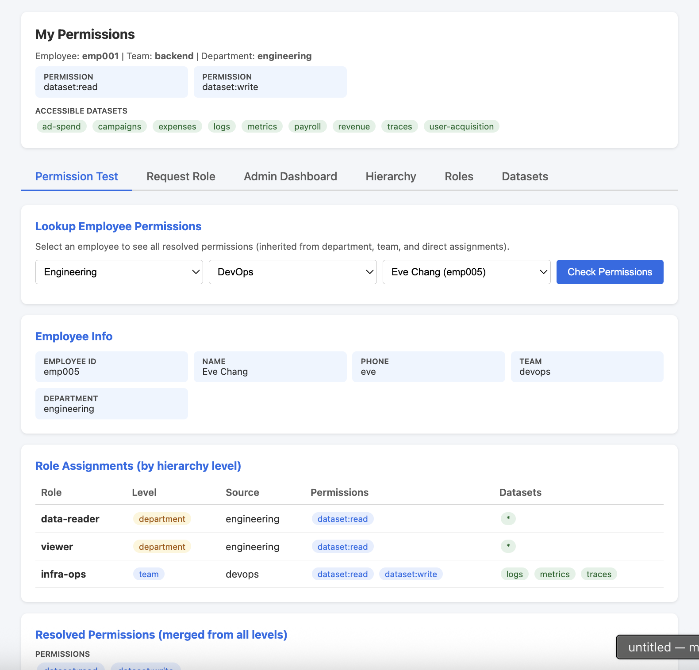
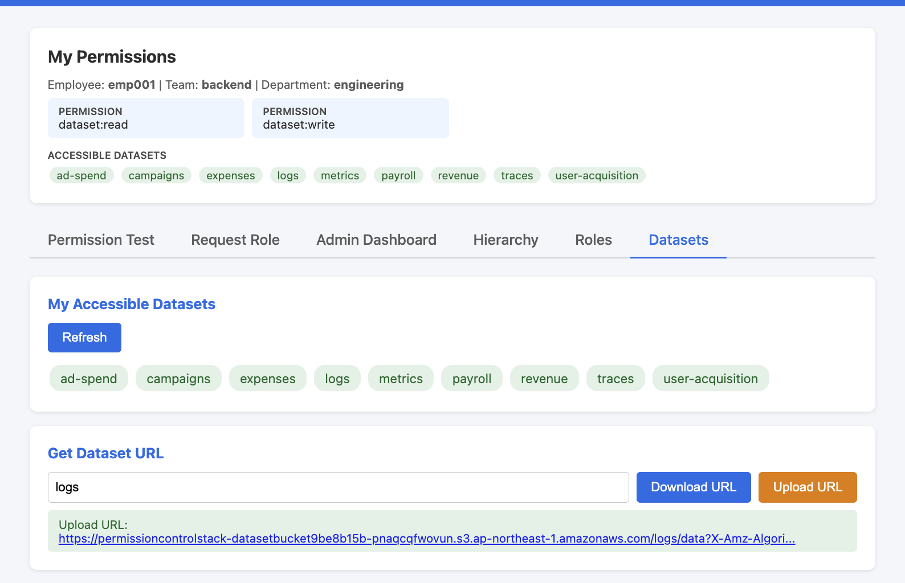

# Permission Control Stack

A role-based access control (RBAC) system for dataset management built with AWS CDK. Implements hierarchical permission inheritance (Department > Team > Employee) combined with role-based permissions, providing fine-grained access control over datasets stored in S3.

## Run

```bash

npm install

cdk bootstrap

cdk deploy

# insert mock data (update API endpoint first)
bash scripts/seed-data.sh

# login
# go to UI, and login with random phone number or below user name:
# - alice
# - bob
# - eve
# - ivy
```

<p align="center"></p>

<p align="center"></p>

<p align="center"></p>


## Features

- **Hierarchical Organization**: Model your org structure as Departments → Teams → Employees
- **Role-Based Access Control**: Define roles with specific permissions and dataset access
- **Permission Inheritance**: Roles assigned at department level automatically apply to teams and employees below
- **Phone-Based Authentication**: Simple JWT-based auth using employee phone numbers (no Cognito required)
- **S3 Dataset Management**: Secure presigned URL generation for dataset access
- **REST API**: Full API for managing hierarchy, roles, and datasets

## Architecture

```
                         ┌──────────────────┐
                         │  API Gateway     │
                         │  (REST API)      │
                         └────────┬─────────┘
                                  │
                   ┌──────────────┼──────────────┐
                   │              │               │
              ┌────▼───┐   ┌─────▼────┐   ┌─────▼─────┐
              │ Auth   │   │Hierarchy │   │ Dataset   │
              │Lambda  │   │ Lambda   │   │ Lambda    │
              └────┬───┘   └─────┬────┘   └─────┬─────┘
                   │              │               │
                   └──────────────┼───────────────┘
                                  │
                         ┌────────▼─────────┐
                         │   DynamoDB       │
                         │   (3 tables)     │
                         └────────┬─────────┘
                                  │
                         ┌────────▼─────────┐
                         │   S3 Bucket      │
                         │   (Datasets)     │
                         └──────────────────┘
```

### Components

| Component | Purpose | Details |
|-----------|---------|---------|
| **API Gateway** | REST API gateway | Routes requests to 3 Lambda functions |
| **Auth Lambda** | Phone verification & JWT | Looks up employees by phone, issues JWT tokens |
| **Hierarchy Lambda** | Org structure CRUD | Manages departments, teams, employees, roles |
| **Dataset Lambda** | Authorization & S3 access | Checks permissions, generates presigned URLs |
| **DynamoDB** | Data persistence | EmployeeHierarchy, Roles, RoleAssignments tables |
| **S3 Bucket** | Dataset storage | Private bucket, access via presigned URLs only |

### Data Model

**EmployeeHierarchy Table**: Stores org structure
- PK: `DEPT#<dept_id>` or `TEAM#<team_id>`
- SK: `TEAM#<team_id>` or `EMP#<emp_id>`
- Fields: `entityType`, `name`, `parentId`, `phone`
- GSI: `phone-index` for quick employee lookup

**Roles Table**: Defines role permissions
- PK/SK: `ROLE#<role_name>`
- Fields: `permissions` (StringSet), `datasets` (StringSet or `["*"]`)

**RoleAssignments Table**: Links hierarchy to roles (supports inheritance)
- PK: `DEPT#<id>`, `TEAM#<id>`, or `EMP#<id>`
- SK: `ROLE#<role_name>`
- Fields: `assignedAt` (timestamp)

## How It Works

### 1. Authentication Flow

```
Employee calls POST /auth/verify { phone: "555-1234" }
                ↓
Auth Lambda looks up employee in EmployeeHierarchy (via phone-index GSI)
                ↓
Returns JWT with claims: { empId, teamId, deptId, permissions }
                ↓
Employee includes JWT in subsequent requests
```

### 2. Authorization Flow

```
Employee calls GET /datasets/{id} with JWT
                ↓
Dataset Lambda extracts JWT claims
                ↓
Queries RoleAssignments at all 3 levels:
  - EMP#<empId>
  - TEAM#<teamId>
  - DEPT#<deptId>
                ↓
Merges all assigned roles → union of permissions & allowed datasets
                ↓
If (dataset in allowed set AND action is permitted):
    → Generate S3 presigned URL + return (200)
Else:
    → Return 403 Forbidden
```

### 3. Permission Inheritance

Roles assigned at higher levels automatically apply to lower levels:

```
Department Level:    DEPT#eng → ROLE#viewer (read all datasets)
         ↓
    Team Level:      TEAM#backend → ROLE#editor (write specific datasets)
         ↓
 Employee Level:     EMP#alice → ROLE#admin (manage roles)

Result: Alice has viewer + editor + admin permissions (union)
```

**No fan-out writes**: Inheritance is resolved at query time by checking all 3 hierarchy levels.

## API Endpoints

### Authentication
- `POST /auth/verify` — Verify employee by phone, get JWT

### Hierarchy Management
- `GET /hierarchy` — List departments
- `POST /hierarchy/departments` — Create department
- `POST /hierarchy/teams` — Create team under department
- `POST /hierarchy/employees` — Create employee under team

### Role Management
- `GET /roles` — List roles
- `POST /roles` — Create role with permissions
- `POST /roles/assign` — Assign role to hierarchy node
- `DELETE /roles/assign` — Revoke role from hierarchy node

### Dataset Access
- `GET /datasets` — List accessible datasets
- `GET /datasets/{id}` — Get presigned S3 URL for dataset
- `PUT /datasets/{id}` — Upload dataset (requires write permission)

## Useful Commands

### Build & Development
- `npm run build` — Compile TypeScript (CDK code)
- `npm run build:lambda` — Compile Lambda functions to `dist/lambda/`
- `npm run watch` — Watch and recompile CDK code
- `npm test` — Run Jest unit tests

### CDK Deployment
- `cdk list` — List all stacks
- `cdk synth` — Synthesize CloudFormation template
- `cdk diff` — Show differences vs deployed stack
- `cdk deploy` — Deploy stack to AWS
- `cdk destroy` — Destroy stack

### Cleanup
- `npm run clean` — Remove compiled JS files
- `npm run clean:all` — Also remove node_modules and cdk.out
